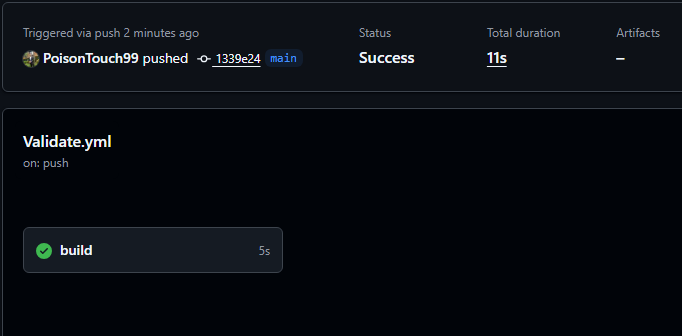

# RaceDay

RaceDay is a system for planning and running race-day events — road races, fun runs, and marathons. Organisers create events and the race categories within them mean while participants browse through published events, enrol in a category and later view their results. This repository contains the ERD, the API endpoint plan and the SQL schema.

## Roles

Here are the roles and what they can do:

**Organiser**: They creates and publish events, 
             * They define categories such as distance, fees and capacity within their own events
             * They view and manage enrolments for their events and record participant results.
             
**Participant**: They browse through published events and categories 
               * They enrol in a category by receiving a bib number 
               * They also view their own enrolment history and their results, as well as the event leaderboards.

## Database

The schema is built around 7 entities: The complete details are in `docs/RaceDay_ERD.png`, and the SQL in `docs/RaceDay_Schema.sql` matches it exactly, with no deviations. `Users` (Organisers and Participants share one table, distinguished by `Role`), `RefreshTokens` (auth), `Events`, `Categories`, `Enrollments` (the many-to-many link between a Participant and a Category), `Results`, and `Payments`.

To run the script: open it in SQL Server Management Studio against a clean instance and execute. It creates `RaceDayDB`, all tables with constraints, and seeds sample data (2 Organisers, 2 Participants, 3 Events, 5 Categories, 4 Enrolments, a Result, and Payments).

## API plan

See `docs/API_Endpoint_Plan.md` for the complete endpoint table covering Authentication, User Profile, Events, Categories, Event Enrolments, and Results — each row includes HTTP method, route, description, required role, request body, and expected responses (including failure codes).

## CI/CD

A GitHub Actions workflow (`.github/workflows/validate-docs.yml`) runs on every push and confirms the `/docs` folder contains the ERD, endpoint plan, and SQL script, and that this README is present.

**Build screenshot:**

## Video walkthrough

**YouTube (unlisted):** _[Insert your unlisted YouTube link here]_

The video covers: the ERD and the reasoning behind each entity and relationship, the endpoint plan and why each route/role was chosen, and a live run of `RaceDay_Schema.sql` in SSMS.
